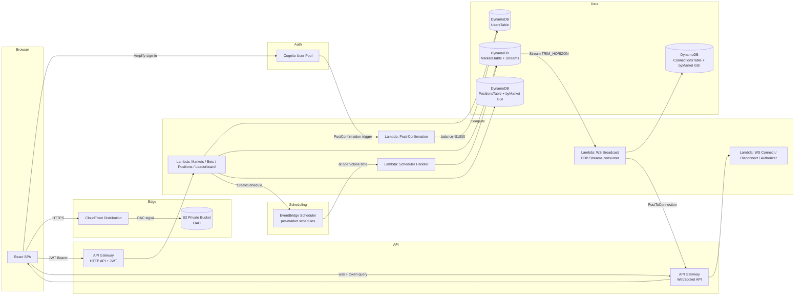

# Classhi

> Kalshi-style prediction markets for CS 1660 lectures — play-money bets on live class events, settled by the professor, backed by a fully serverless AWS stack that deploys with a single `sam deploy`.

**Course:** CS 1660 Cloud Computing — Final Project
**Deadline:** April 29, 2026
**Live URL:** `https://<CloudFrontDomainName>.cloudfront.net` (see stack outputs after deploy)

---

## Overview

Classhi is a lightweight prediction market platform. Students sign up, receive $1000 play-money, and place YES/NO bets on markets created by the professor ("Will the professor say 'AWS' more than 10 times today?"). Bets shift a constant-sum price model; WebSocket pushes drive sub-3-second price updates across all browsers. Markets auto-transition from `scheduled → open → closed` via EventBridge Scheduler; the professor resolves closed markets, triggering atomic payouts to winning position holders.

The stack is 100% serverless — no EC2, no containers, no VPC. The entire infrastructure is declared in a single `template.yaml` and deploys from a clean clone via `sam build && sam deploy`. A GitHub Actions pipeline auto-deploys both backend and frontend on push to main, authenticated via OIDC (no long-lived AWS keys).

---

## Architecture



### ASCII fallback

```
                    +-----------------------------+
Browser (React SPA) |  https://<cf>.cloudfront.net|
   |                +--------------+--------------+
   |                               |
   |  Amplify/Cognito JWT          |  OAC sigv4
   |                               v
   v                        +------+-------+
+--+-----+                  |     S3       |  private bucket, no public ACL
|Cognito |                  +--------------+
|  Pool  |
+--+-----+     HTTP API (JWT)              WebSocket API (Lambda authorizer)
   |  +----------+-----------+               +-------+-------+
   |  | /markets /me /bets   |               | $connect      |
   |  | /leaderboard /resolve|               | $disconnect   |
   |  +-----+----------+-----+               +-------+-------+
   |        |          |                             |
   v        v          v                             v
  +-------+ +----------+---+          +--------------+------+
  | Lambdas| | Market/Bet  |          | WS Authorizer / Conn|
  +-------++-+-------------+          +--+---------------+--+
          |                              |               |
          v                              v               v
  +-------+-----+   Stream    +----------+---+     +----+----------+
  | DynamoDB    +-----------> | WS Broadcast |     |ConnectionsTable|
  | (4 tables)  |             | Lambda       |     +---+-----------+
  +-------+-----+             +--------+-----+         |
          |                            |               |
          |  CreateSchedule            | PostToConn    |
          v                            v               |
  +-------+----------+     +-----------+-------+       |
  | EventBridge      |     | API GW Mgmt API   <-------+
  | Scheduler        |     | (push frames)     |
  +--+---------------+     +-------------------+
     |
     |  at open/close time
     v
  +--+---------------+
  | Scheduler Lambda |
  +------------------+
```

---

## Services & Justification

| # | Service | Purpose | Why it's the right fit |
|---|---------|---------|------------------------|
| 1 | **Amazon Cognito** (User Pool + PostConfirmation) | Email/password sign-up, login, JWT issuance, $1000 balance provisioning | Managed auth — no credential handling, no password hashing code. PostConfirmation trigger hooks the first-login balance seed cleanly. |
| 2 | **API Gateway HTTP API** | REST routes (`/markets`, `/me`, `/leaderboard`, `/markets/{id}/bets`, `/markets/{id}/resolve`) | Native JWT authorizer validates Cognito tokens without a custom Lambda — lower latency + cost than REST API. |
| 3 | **API Gateway WebSocket API** | Real-time price updates pushed to subscribed clients | Managed WebSocket with stable connection IDs; Lambda authorizer handles JWT via query-string (browsers can't set WS headers). |
| 4 | **AWS Lambda** (15 functions, ARM64 Node.js 20) | All business logic: market CRUD, bet placement, payout fan-out, WebSocket handlers, scheduler callback, leaderboard | Per-route isolation; pay-per-invoke; ARM64 saves ~20% vs. x86. Zero ops burden. |
| 5 | **Amazon DynamoDB** (4 tables) | Primary data store: users, markets, positions, websocket connections | Single-digit-ms reads, serverless, on-demand billing, atomic `TransactWriteItems` for lost-update-free bet placement (BET-04). |
| 6 | **DynamoDB Streams** (MarketsTable) | Event source for WebSocket price broadcast | Decouples price updates from the bet-placement write path — the broadcaster reads the stream and fans out updates without blocking user requests. `TRIM_HORIZON` + `ReportBatchItemFailures` prevent dropped events. |
| 7 | **Amazon EventBridge Scheduler** | Per-market one-time schedules for `scheduled → open` and `open → closed` transitions | `ScheduleV2` supports timezones + automatic deletion (`ActionAfterCompletion: DELETE`) — unlike classic EventBridge Rules which are UTC-only. Replaces cron polling entirely. |
| 8 | **Amazon S3** (private, OAC) | Host Vite-built frontend static assets | Cheap, durable, scales to grading traffic. Public access fully blocked; only CloudFront OAC can read objects. |
| 9 | **Amazon CloudFront** (+ OAC) | HTTPS edge delivery of the SPA; SPA routing fallback | HTTPS required (INFRA-04); OAC is the current replacement for deprecated OAI; CustomErrorResponses map both 403 and 404 → `/index.html` so React Router sub-routes (`/leaderboard`, `/markets/:id`) work on direct navigation. |

**Deliberate exclusions** (not part of the 9): SNS, SQS, VPC, CloudWatch alarms, X-Ray. Real-time fan-out is handled by DynamoDB Streams + WebSocket — SNS/SQS would be redundant. No networking is needed for fully-managed services; no VPC required.

---

## Project Structure

```
.
├── backend/                           # pnpm workspace: classhi-backend
│   └── src/handlers/                  # 15 Lambda handlers, 1 directory each
│       ├── create-market/
│       ├── get-leaderboard/
│       ├── get-market/
│       ├── get-me/
│       ├── get-positions/
│       ├── health/
│       ├── list-markets/
│       ├── place-bet/
│       ├── post-confirmation/
│       ├── resolve-market/
│       ├── scheduler-handler/
│       ├── ws-authorizer/
│       ├── ws-broadcast/
│       ├── ws-connect/
│       └── ws-disconnect/
├── frontend/                          # pnpm workspace: classhi-frontend
│   └── src/
│       ├── App.tsx                    # React Router + RequireAuth
│       ├── auth/                      # AuthContext + Amplify glue
│       ├── lib/api.ts                 # apiFetch wrapper
│       ├── pages/                     # LoginPage, MarketListPage, LeaderboardPage, ...
│       └── hooks/                     # useMarketWS (WebSocket)
├── .github/workflows/deploy.yml       # OIDC CI/CD (backend + frontend)
├── template.yaml                      # All AWS infra (SAM)
├── samconfig.toml                     # Deploy config (stack=classhi, region=us-east-1)
└── pnpm-workspace.yaml
```

---

## Quick Start

### Prerequisites

- Node.js 22+, pnpm 10, AWS CLI v2, AWS SAM CLI 1.158+
- AWS account with administrator access (demo project)
- `esbuild` on PATH (globally installed — SAM requires this at the system level)

### Deploy from a fresh clone

```bash
pnpm install --frozen-lockfile
sam build
sam deploy --guided              # first time only — fills in samconfig.toml
# or, on subsequent deploys:
sam deploy --no-confirm-changeset --no-fail-on-empty-changeset
```

After deploy, capture the output values:

```bash
aws cloudformation describe-stacks --stack-name classhi --region us-east-1 \
  --query "Stacks[0].Outputs" --output table
```

### Run the frontend locally

```bash
cd frontend
cp .env.example .env.local   # populate with stack outputs: UserPoolId, UserPoolClientId, HttpApiUrl, WebSocketApiUrl
pnpm run dev                 # http://localhost:5173
```

### CI/CD

Push to `main` triggers `.github/workflows/deploy.yml`:

1. `deploy-backend` runs `sam deploy` (OIDC; no long-lived keys).
2. `deploy-frontend` runs `pnpm run build` in `frontend/`, syncs `dist/` to S3, and invalidates CloudFront (`/*`).


- IAM OIDC provider for `token.actions.githubusercontent.com`
- IAM role `classhi-github-deploy` with trust scoped to this repo
- Four GitHub repo secrets: `VITE_USER_POOL_ID`, `VITE_USER_POOL_CLIENT_ID`, `VITE_HTTP_API_URL`, `VITE_WS_API_URL`

---

## Key Design Decisions

- **Phantom liquidity seed** (`volume = 100` on market creation) prevents first-bet price collapse — without it, the first $10 YES bet moves the price 50→99 instead of 50→52.
- **`TransactWriteItems` + retry-on-conflict** makes bet placement atomic across the balance → volume → position update (BET-04). `ClientRequestToken` (36-char truncation) prevents double-charges on Lambda retry.
- **WebSocket JWT via query string** — browsers can't set custom headers on `new WebSocket(url)`; the Cognito ID token rides as `?token=...` and is validated by a Lambda REQUEST authorizer.
- **DynamoDB Streams `TRIM_HORIZON` + `ReportBatchItemFailures`** — LATEST misses events during event-source-mapping creation; partial batch reporting prevents re-broadcasting all 10 updates when one connection has gone stale.
- **EventBridge Scheduler with `ActionAfterCompletion: DELETE`** — schedules vanish automatically after firing; no cron polling, no cleanup scripts.
- **CloudFront `CustomErrorResponses` for BOTH 403 AND 404** — S3 + OAC returns 403 (not 404) on missing paths; without mapping 403 → `/index.html`, SPA sub-routes get "Access Denied" on direct navigation.

---

## Requirements Coverage

All 33 v1 requirements are mapped in `.planning/REQUIREMENTS.md`. Phase progress lives in `.planning/ROADMAP.md`.

Highlights:

- **Auth**: Cognito + Amplify v6 + PostConfirmation → $1000 balance (AUTH-01..05)
- **Markets / Betting**: constant-sum YES/NO pricing, atomic transactions (MKTL-01..04, BET-01..05)
- **Real-time**: <3s WebSocket price flash (RT-01..03)
- **Portfolio**: open + settled positions with P&L (PORT-01..03)
- **Leaderboard**: top 20 + own rank (LEAD-01..02)
- **Admin**: create + resolve markets, server-side gate (ADMIN-01..04)
- **Scheduling**: EventBridge Scheduler auto-transitions (SCHED-01..02)
- **Infra**: single `sam deploy`, HTTPS via CloudFront, OIDC CI/CD, this README (INFRA-01..05)

---

## Future Work

- Swap constant-sum pricing for LMSR
- Price history chart (time-series pipeline)
- Real-time leaderboard updates via WebSocket (currently polled)
- Category tags + market filtering

---

## License

Educational use only — CS 1660 Final Project.
